::: {.identificacao}

Contato: andersonheri@gmail.com

**Fonte dos dados**: microdados públicos do Censo Escolar da Educação Básica e do IDEB (INEP). Os dados de origem são públicos; a síntese, as figuras e a interpretação reunidas neste relatório constituem material de entrega desta consultoria.

:::

```{=openxml}
<w:p><w:r><w:br w:type="page"/></w:r></w:p>
```

```{=html}
<div style="page-break-before: always;"></div>
```

## Sumário

- Resumo
- 1. Introdução e objetivo
- 2. Dados e método
- 3. Resultados
  - 3.1 Panorama geral do vínculo contratual dos docentes (Brasil, 2025)
  - 3.2 Vínculo por rede de ensino (dependência administrativa)
  - 3.3 Vínculo por localização (urbana e rural)
  - 3.4 Vínculo por região e Unidade da Federação
  - 3.5 Heterogeneidade municipal do vínculo contratual
  - 3.6 Evolução do quadro docente por etapa de ensino (2015 a 2025)
  - 3.7 Cruzamento entre vínculo contratual e desempenho educacional (IDEB)
- 4. Discussão e síntese das conclusões
- Fontes e material de apoio

```{=openxml}
<w:p><w:r><w:br w:type="page"/></w:r></w:p>
```

```{=html}
<div style="page-break-before: always;"></div>
```

## Resumo

Este relatório descreve o vínculo contratual dos docentes da educação básica brasileira em 2025 (concursado/efetivo, contratado temporário, CLT ou terceirizado) e sua distribuição por rede de ensino, localização urbana/rural, região, UF e município, com base nos microdados do Censo Escolar (INEP). Complementarmente, descreve a evolução da força docente por etapa de ensino entre 2015 e 2025, e testa se a proporção de docentes contratados está associada ao desempenho educacional medido pelo IDEB 2025. Os resultados mostram que 40,8% dos docentes com vínculo informado (essencialmente a rede pública) são contratados, não concursados, com forte heterogeneidade entre redes (13,5% na rede federal a 49,6% na estadual), localização (37,6% na zona urbana a 56,4% na rural) e território (10,5% no Rio de Janeiro a 67,7% no Acre, entre UFs; de 0% a mais de 96% entre municípios). A correlação entre essa proporção e o IDEB é estatisticamente significativa ao nível de município, mas de magnitude muito baixa (r entre -0,04 e -0,11), e não significativa ao nível de UF, não sustentando o vínculo contratual como fator explicativo relevante e isolado do desempenho educacional.

---

## 1. Introdução e objetivo

Este relatório descreve o perfil dos docentes da educação básica brasileira em 2025, com foco em duas dimensões: a etapa de ensino em que atuam (educação infantil, anos iniciais e finais do fundamental, ensino médio) e, principalmente, o tipo de vínculo contratual que mantêm com a rede de ensino (concursado/efetivo, contratado temporário, CLT ou terceirizado). A pergunta central é simples de enunciar e relevante para a gestão educacional: que proporção do corpo docente brasileiro trabalha sem estabilidade de vínculo (contratos temporários, CLT ou terceirização), e como essa proporção varia entre redes de ensino, regiões, UFs e municípios?

Como desdobramento, o relatório também examina se essa característica do vínculo contratual está associada ao desempenho educacional medido pelo IDEB, testando a hipótese de que uma maior proporção de docentes contratados (em vez de concursados) esteja relacionada a resultados piores.

O relatório é descritivo: apresenta distribuições, comparações entre grupos e uma análise de correlação simples. Não se trata de uma análise causal, e as limitações de cada etapa são explicitadas ao longo do texto.

---

## 2. Dados e método

**Etapa de ensino.** A variável de etapa (quantos docentes atuam na educação infantil, nos anos iniciais e finais do fundamental e no ensino médio) está disponível em todos os Censos Escolares de 2015 a 2025, permitindo observar a evolução da década.

**Vínculo contratual.** A variável de vínculo contratual do docente (`QT_DOC_BAS_VINCULO_CONCUR`, `_CONTRA`, `_TERCEIR`, `_CLT`) só passou a existir no Censo Escolar a partir da edição de 2025. Isso foi confirmado exaustivamente nos microdados de 2015 a 2024: a variável simplesmente não existe nessas edições. Por esse motivo, toda a análise de vínculo contratual deste relatório é um retrato do ano de 2025, sem série histórica.

**A variável de vínculo só é informada para a rede pública.** A rede privada (federal, estadual e municipal são as três redes públicas; a quarta categoria de dependência administrativa é a rede privada) não reporta essa informação ao Censo — as quatro categorias de vínculo aparecem como zero para 100% dos docentes da rede privada. Isso é coerente com a própria natureza da variável (vínculo estatutário/CLT/temporário é um conceito de gestão de pessoal do setor público) e é tratado de forma explícita ao longo do relatório: a rede privada representa 651.655 docentes da educação básica em 2025 (21,8% do total), e todos eles ficam fora do indicador de vínculo.

**Duas bases de cálculo para as percentagens de vínculo.** Ao longo do relatório, os percentuais de vínculo (concursado, contratado, CLT, terceirizado) aparecem calculados sobre duas bases diferentes, dependendo da comparação:

- **(a) sobre o total de docentes do grupo** (denominador = total de docentes da educação básica daquele grupo, incluindo a rede privada quando o grupo mistura redes, como uma UF ou um município). Essa é a base usada nos rankings por município e por UF.
- **(b) sobre o subtotal de docentes com vínculo efetivamente informado** (soma das quatro categorias de vínculo, que na prática coincide com a rede pública). Essa é a base usada nas comparações por rede de ensino, localização urbana/rural, região e no total nacional.

Como o "não informado" é, na prática, quase inteiramente a rede privada, os dois cálculos convergem dentro de um grupo 100% público (uma rede estadual, por exemplo) e diferem quando o grupo mistura rede pública e privada. Um exemplo concreto: nacionalmente, 32,3% do total geral de docentes são contratados (base a, denominador inclui a rede privada), mas 40,8% dos docentes com vínculo informado são contratados (base b, denominador é só quem responde a essa variável). Cada seção deste relatório indica qual base está sendo usada.

**Docentes podem atuar em mais de uma etapa.** As variáveis de etapa (`QT_DOC_INF`, `QT_DOC_FUND_AI`, `QT_DOC_FUND_AF`, `QT_DOC_MED`) não são mutuamente exclusivas: um mesmo docente que leciona, por exemplo, tanto nos anos finais do fundamental quanto no ensino médio é contabilizado nas duas categorias. Por isso, ao somar as participações de cada etapa dentro de um grupo, o total pode superar 100%. Isso é normal e esperado nos microdados do Censo, e é mencionado sempre que relevante.

**IDEB.** O IDEB da edição 2025 já havia sido divulgado pelo INEP no momento desta análise, o que permitiu cruzar vínculo contratual (2025) e IDEB (2025) no mesmo ano, sem descompasso temporal. O IDEB não avalia a educação infantil (não há Saeb nessa etapa), então o cruzamento cobre apenas anos iniciais, anos finais e ensino médio. Além disso, na base de UF/região do IDEB, a etapa de Ensino Médio não possui uma linha agregada "rede pública" (a rede municipal não oferece ensino médio e a rede federal é residual e não aparece separada nessa aba); nesse caso específico, usou-se a rede Estadual como proxy da rede pública, o que é razoável dado que o ensino médio público é, na prática, quase inteiramente estadual.

---

## 3. Resultados

### 3.1 Panorama geral do vínculo contratual dos docentes (Brasil, 2025)

O Brasil tinha, em 2025, 2.992.045 docentes na educação básica. Considerando o total geral de docentes (base a, incluindo a rede privada, que não informa vínculo): 44,9% são concursados/efetivos, 32,3% são contratados (não concursados), 1,4% estão em regime CLT, 0,5% são terceirizados, e os 20,9% restantes (essencialmente a rede privada) não têm essa informação coletada.

Restringindo a leitura aos 2.369.202 docentes com vínculo efetivamente informado (base b, essencialmente a rede pública), o quadro se torna o da figura abaixo.

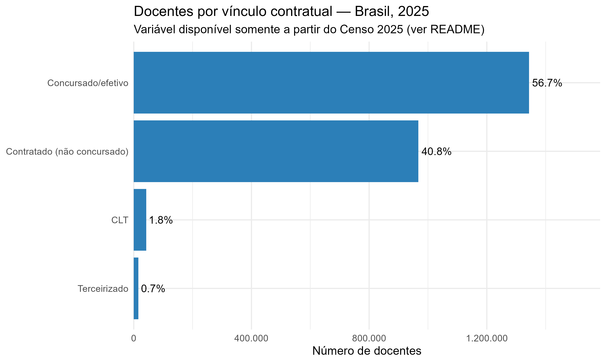

A leitura central deste indicador é: **entre os docentes da rede pública, quase 2 em cada 5 (40,8%) não têm vínculo concursado** — trabalham sob contrato temporário. As categorias de CLT (1,8%) e terceirizado (0,7%) são residuais em termos nacionais, mas, como se verá na seção 3.2, ganham peso em redes específicas (CLT é notavelmente mais comum na rede estadual e em São Paulo). O grupo dos contratados temporários é, disparadamente, o mais exposto a rotatividade, descontinuidade pedagógica e insegurança no emprego, e é o foco do restante deste relatório.

### 3.2 Vínculo por rede de ensino (dependência administrativa)

A proporção de docentes contratados varia de forma muito acentuada entre as quatro redes de ensino. Os percentuais desta seção usam a base (b): são calculados sobre o subtotal de docentes com vínculo informado dentro de cada rede.

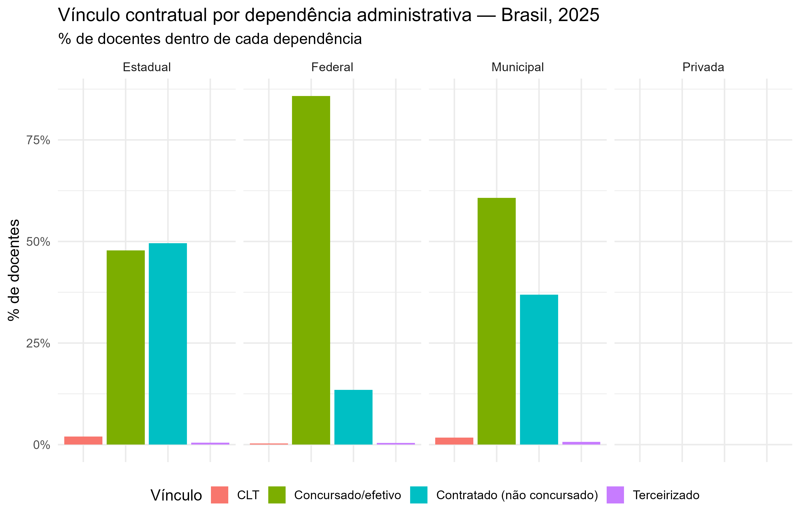

A rede **federal** (40.052 docentes) é a mais estável: apenas 13,5% de seus docentes são contratados, e 85,8% são concursados/efetivos, refletindo o peso dos institutos federais e universidades federais, historicamente mais estruturados em torno de carreiras concursadas. A rede **estadual** (805.009 docentes) é a mais dividida: praticamente meio a meio entre concursados (47,8%) e contratados (49,6%) — ou seja, é a rede pública com a maior dependência proporcional de contratação temporária, e também a que apresenta a maior fração de CLT (2,0%). A rede **municipal** (1.495.329 docentes), embora tenha maioria concursada (60,7%), ainda apresenta uma parcela relevante de contratados (36,9%), sobre a maior base absoluta de docentes do país — o que significa que, em número de pessoas, a rede municipal concentra o maior contingente absoluto de docentes contratados (mais de 550 mil pessoas), mesmo não sendo a rede com a maior proporção. A rede **privada** (651.655 docentes) não informa essa variável ao Censo.

### 3.3 Vínculo por localização (urbana e rural)

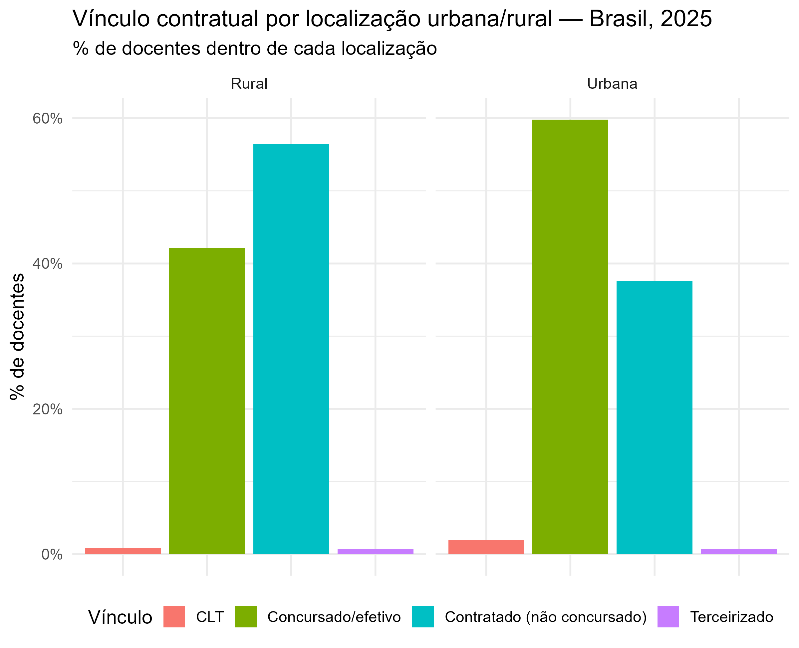

A diferença é grande e vai no sentido esperado: nas escolas rurais (413.464 docentes), a **maioria dos docentes (56,4%) é contratada**, contra 37,6% nas escolas urbanas (2.578.581 docentes, com 59,8% de concursados). Isso sugere que a fragilidade do vínculo contratual não está distribuída de forma uniforme pelo território: escolas rurais, tipicamente mais distantes e com menor atratividade para concursos e fixação de efetivos, dependem proporcionalmente mais de contratação temporária para preencher vagas docentes. Vale notar que a zona rural concentra uma fração pequena do total de docentes (13,8% do total nacional), então, em termos absolutos, o número de docentes contratados ainda é maior na zona urbana (735.483 contra 232.116 na zona rural) — mas proporcionalmente, é na zona rural que o vínculo precário é a norma, não a exceção.

### 3.4 Vínculo por região e Unidade da Federação

Por região (base b, % sobre docentes com vínculo informado), o Sudeste e o Sul são as regiões com maior proporção de docentes concursados (60,6% e 58,3%, respectivamente); o Centro-Oeste, o Nordeste e o Norte concentram, proporcionalmente, mais docentes contratados, com o Centro-Oeste na liderança (47,2%), seguido de perto pelo Nordeste (46,2%) e pelo Norte (44,3%). É interessante notar que a categoria CLT é claramente concentrada no Sudeste (3,4%, mais que o dobro do Sul, segundo colocado, com 1,6%) — um reflexo, adiantando o próximo parágrafo, do peso de São Paulo nessa categoria específica.

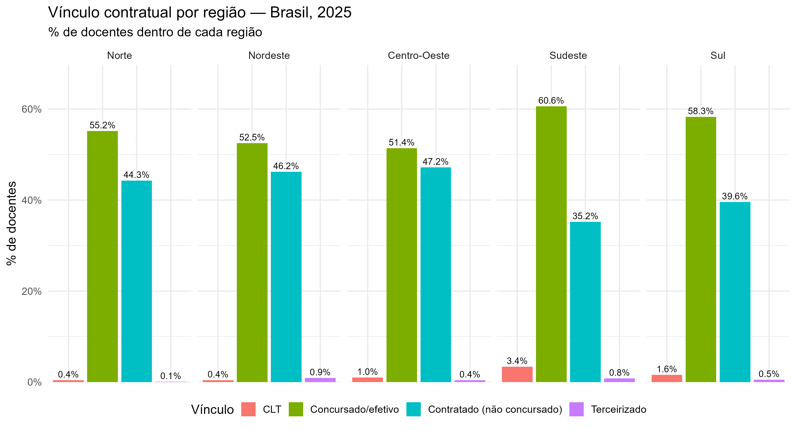

O mapa abaixo decompõe essa mesma informação por UF e por categoria de vínculo, em quatro painéis (CLT, Concursado/efetivo, Contratado e Terceirizado). Ele confirma visualmente o que os números já indicam: Roraima e Amazonas se destacam com a maior proporção de concursados do país (painel "Concursado/efetivo"), o Acre se destaca isoladamente no painel "Contratado", e os painéis de CLT e Terceirizado são visualmente quase uniformes e escuros (valores baixos) em todo o território, com pequenas exceções localizadas (São Paulo em CLT, Rio Grande do Norte em Terceirizado).

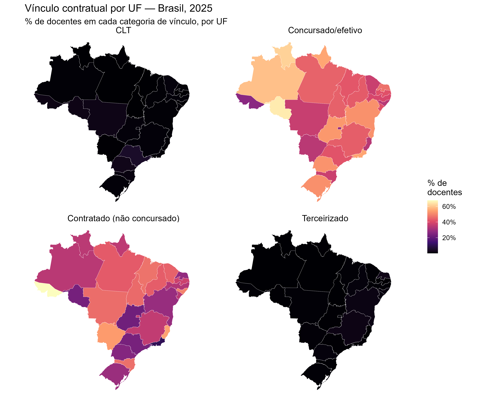

Ao nível de UF (base a, % contratados sobre o total geral de docentes da UF, média nacional de 32,3%), a variação é a maior de toda a análise territorial: o ranking vai de 10,5% no Rio de Janeiro a 67,7% no Acre — uma diferença de mais de seis vezes entre os extremos. Depois do Acre, as maiores proporções são Espírito Santo (54,8%), Mato Grosso do Sul (53,5%), Alagoas (49,4%) e Maranhão (46,9%); depois do Rio de Janeiro, as menores são Goiás (22,2%), Rondônia (23,1%), São Paulo (23,5%) e Paraná (25,8%). O padrão geral acompanha o já descrito por região: UFs do Norte e Nordeste tendem a concentrações mais altas de contratação temporária, e UFs do Sudeste e Sul (com exceções, como o próprio Espírito Santo) tendem a concentrações mais baixas. Note que esse ranking usa base (a), o que explica por que os números não são diretamente comparáveis, célula a célula, com os percentuais por região do parágrafo anterior (que usam base b).

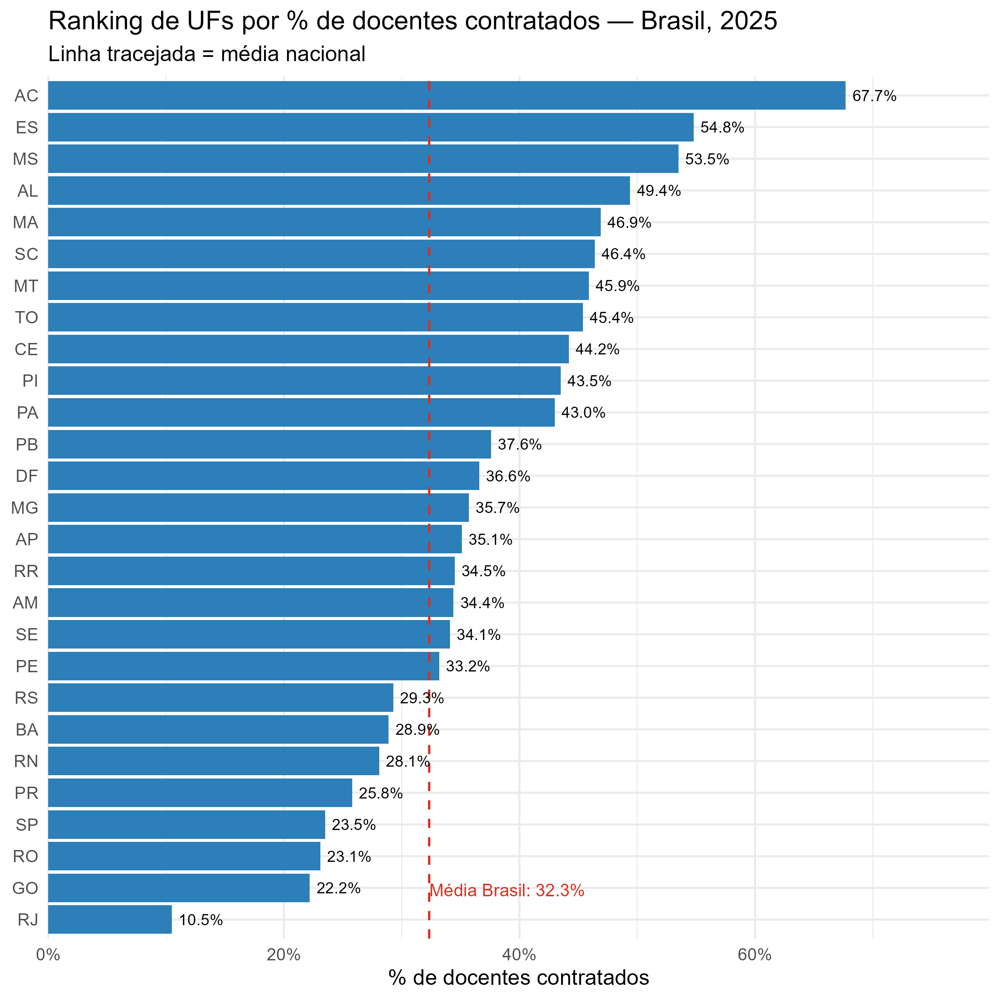

**Percentual alto não é o mesmo que número alto de pessoas.** O mapa abaixo mostra o total absoluto de docentes por UF: São Paulo concentra, isoladamente, o maior contingente docente do país (601.999 docentes, mais que o dobro do segundo colocado, Minas Gerais), o que é relevante para interpretar o ranking anterior: São Paulo tem um percentual de contratados relativamente baixo (23,5%), mas, por ser um estado enorme, esse percentual já representa 141.239 docentes contratados em números absolutos — o maior contingente absoluto do país, maior até que o de Minas Gerais (108.341) e muito maior que o do Acre (8.726 docentes contratados, apesar de ter o maior percentual). Ou seja: se a preocupação de política pública for "onde estão as maiores taxas de precarização", o Acre e o Espírito Santo lideram; se for "onde estão as maiores populações afetadas em números absolutos", São Paulo e Minas Gerais lideram — são leituras diferentes e complementares do mesmo fenômeno.

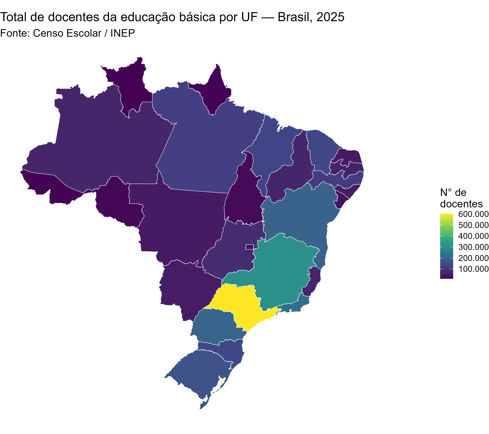

### 3.5 Heterogeneidade municipal do vínculo contratual

A média de uma UF esconde uma variação interna muito maior entre seus municípios. Para captar essa dimensão, restringimos a análise a municípios com pelo menos 30 docentes (para evitar que municípios muito pequenos, onde um ou dois docentes já mudam o percentual drasticamente, distorçam o retrato).

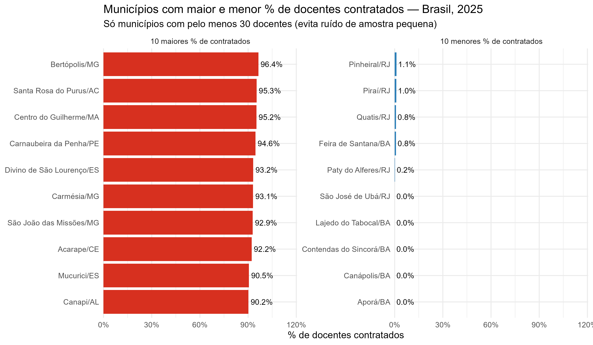

A amplitude é total: de municípios onde **praticamente nenhum docente é contratado** — São José de Ubá/RJ, Lajedo do Tabocal/BA, Contendas do Sincorá/BA, Canápolis/BA e Aporá/BA, todos em 0,0%, com Pinheiral/RJ, Piraí/RJ, Quatis/RJ e Feira de Santana/BA também abaixo de 1,2% — até municípios onde **quase todo o corpo docente é contratado**, como Bertópolis/MG (96,4%), Santa Rosa do Purus/AC (95,3%) e Centro do Guilherme/MA (95,2%). É notável que municípios do Rio de Janeiro e da Bahia aparecem nos dois extremos da distribuição (RJ e BA concentram vários dos menores percentuais, mas municípios baianos e mineiros também aparecem entre os maiores), o que já é um indício de que a variação **dentro** de uma mesma UF pode ser tão ou mais importante que a variação **entre** UFs — o que o gráfico de variabilidade a seguir confirma.

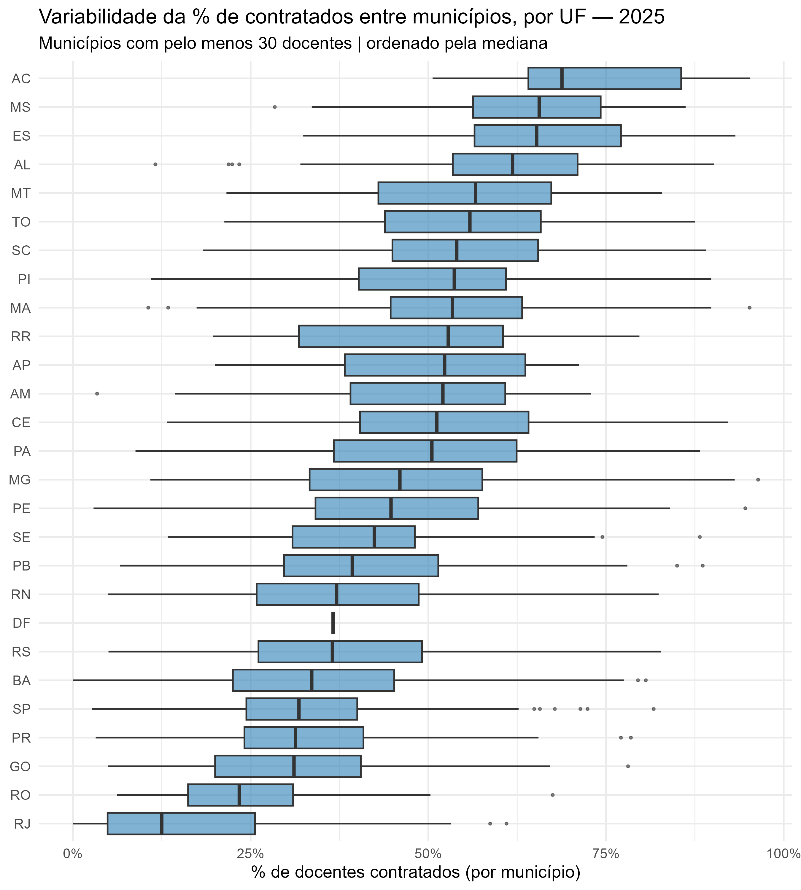

O boxplot, com os municípios de cada UF ordenados pela mediana, mostra que mesmo UFs com médias moderadas escondem amplitudes internas muito grandes. O Acre, por exemplo, tem mediana municipal alta (em torno de 70%) mas caixa (intervalo interquartil) que vai de aproximadamente 50% a 85%. Roraima e o Rio de Janeiro têm as caixas mais largas relativas à sua mediana, indicando municípios extremamente heterogêneos entre si dentro do mesmo estado — no caso do Rio de Janeiro, a caixa vai de próximo de 0% a mais de 25%, apesar de a média estadual (10,5%) ser a mais baixa do país. Já São Paulo, apesar de ter uma das médias mais baixas do país, tem uma cauda de municípios-outlier (pontos isolados à direita do bigode) que chegam a mais de 75% de contratados, mostrando que mesmo estados "bem-comportados" na média têm municípios fora da curva. O Distrito Federal, por ser essencialmente um único município, aparece como uma linha praticamente sem variação.

A conclusão prática desta seção é que **políticas ou diagnósticos formulados apenas no nível de UF podem mascarar realidades municipais muito distintas** — inclusive municípios com pouquíssima dependência de contratação temporária e municípios quase inteiramente dependentes dela, dentro do mesmo estado.

### 3.6 Evolução do quadro docente por etapa de ensino (2015 a 2025)

Diferente do vínculo contratual, a variável de etapa de ensino existe em toda a série 2015–2025, permitindo observar tendência. *(Lembrando a nota metodológica da seção 2: como um mesmo docente pode atuar em mais de uma etapa, as participações a seguir não são mutuamente exclusivas e sua soma pode superar 100%.)*

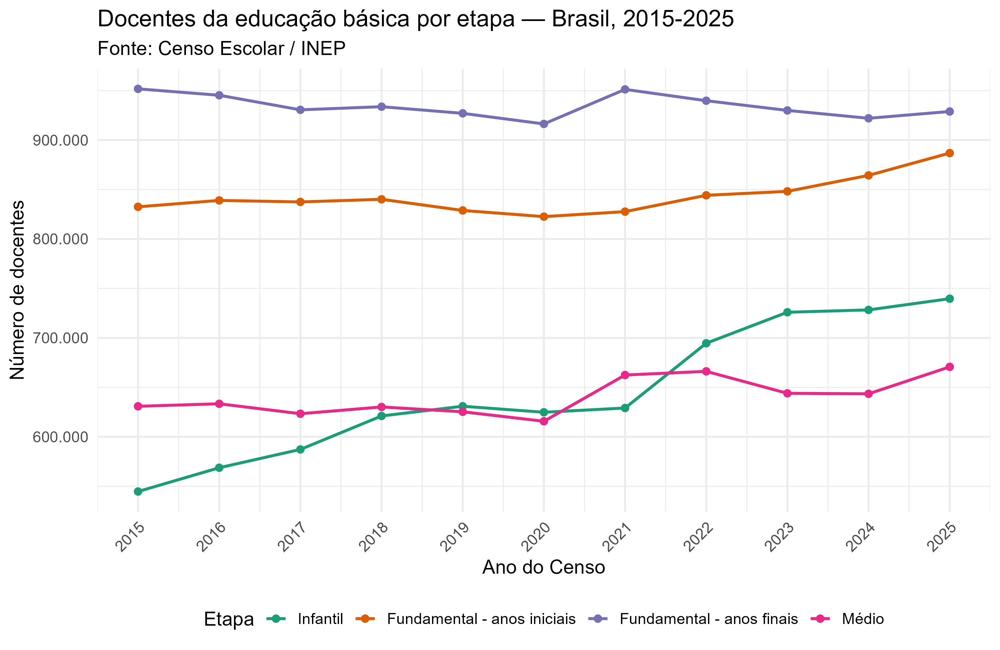

O total de docentes da educação básica cresceu 7,4% na década (de 2.784.910 em 2015 para 2.992.045 em 2025), com uma queda temporária entre 2018 e 2020 (provavelmente associada ao início da pandemia de covid-19 e seus efeitos sobre matrículas) seguida de recuperação e crescimento a partir de 2021. O destaque da década é o crescimento da participação da **educação infantil**, que passou de 19,6% para 24,7% dos docentes — um aumento de 5,1 pontos percentuais, coerente com a expansão de creches e pré-escolas observada no período (em linha com metas do Plano Nacional de Educação para essa etapa). Em contrapartida, a participação dos **anos finais do fundamental** recuou de 34,2% para 31,0%. Anos iniciais (29,9% para 29,6%) e ensino médio (22,7% para 22,4%) mantiveram participação relativamente estável, com uma leve aceleração do ensino médio a partir de 2021.

Olhando a composição por rede (a figura a seguir usa uma escala de eixo Y própria em cada painel, pois as redes têm portes muito diferentes), o padrão de especialização por etapa é nítido:

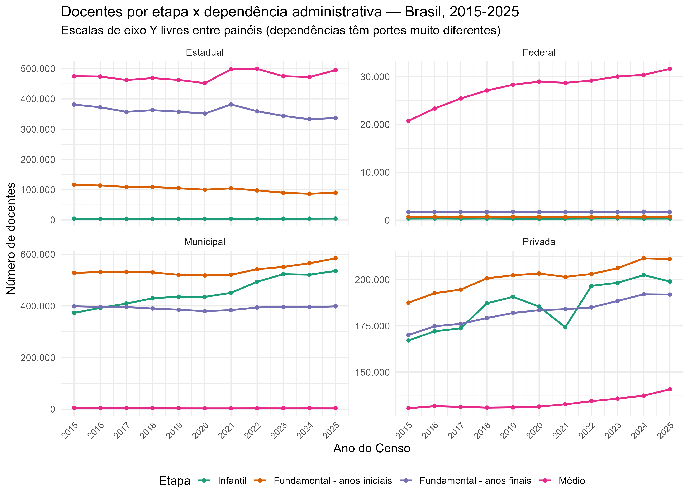

A rede **federal** é dominada quase inteiramente pelo ensino médio, que cresceu de forma constante ao longo da década, de aproximadamente 21 mil para 31,6 mil docentes (+51%) — reflexo da expansão dos institutos federais; as demais etapas são residuais nessa rede. A rede **estadual** tem o ensino médio como sua maior categoria (por volta de 450 a 500 mil docentes ao longo da década, relativamente estável), seguida pelos anos finais do fundamental (entre 330 e 380 mil, com leve tendência de queda); os anos iniciais estaduais estão em queda mais visível, de cerca de 115 mil para 90 mil docentes (-22%), coerente com o processo histórico de municipalização dessa etapa, e a educação infantil é quase inexistente nessa rede. A rede **municipal** concentra o maior contingente de docentes nos anos iniciais do fundamental (de cerca de 520 mil para 585 mil) e, com o crescimento mais expressivo de toda a década, na educação infantil, que saltou de aproximadamente 375 mil para 535 mil docentes (+43%); os anos finais municipais permaneceram estáveis (390 a 400 mil), e o ensino médio é praticamente inexistente (municípios raramente oferecem essa etapa). A rede **privada** é a única em que todas as quatro etapas têm presença relevante e crescem ao longo da década, com destaque para os anos iniciais (188 mil para 215 mil) e a educação infantil (165 mil para 199 mil, com uma queda visível em 2021 — provavelmente ligada à evasão de matrículas privadas durante a pandemia — e recuperação forte depois).

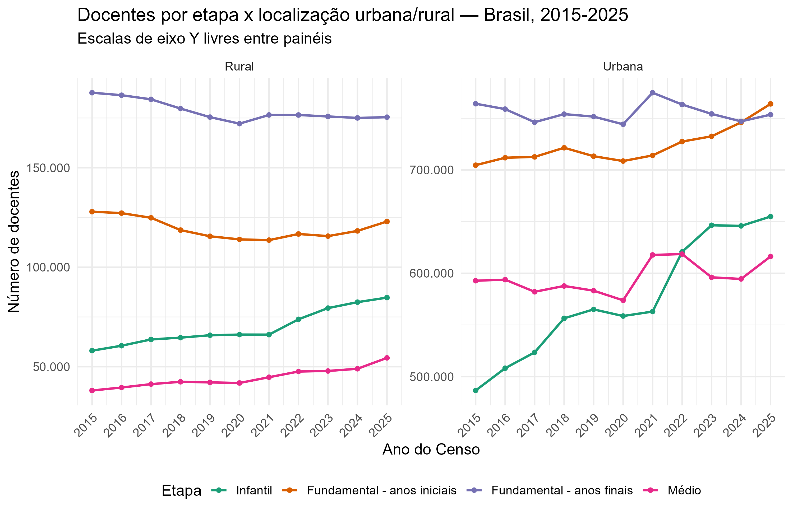

Na zona **rural**, os anos finais do fundamental são a maior categoria ao longo de toda a década (entre 170 e 185 mil docentes, com leve queda), seguidos pelos anos iniciais (115 a 130 mil); a educação infantil rural cresce de forma constante e relevante (de 58 mil para 85 mil, +46%), e o ensino médio rural, embora seja a menor categoria, também cresce de forma proporcionalmente forte (de 38 mil para 54 mil, +42%) — sinal de uma tentativa de interiorização do ensino médio no campo. Na zona **urbana**, o padrão histórico se inverte ao final da série: os anos iniciais do fundamental, que começam a década como a segunda maior categoria (cerca de 705 mil docentes, atrás dos anos finais), terminam 2025 como a maior de todas (886 mil); a educação infantil urbana tem o crescimento mais acentuado (de aproximadamente 486 mil para 654 mil docentes, +35%), com um degrau bem marcado entre 2020 e 2022, coincidindo com o período pós-pandemia.

### 3.7 Cruzamento entre vínculo contratual e desempenho educacional (IDEB)

Uma pergunta natural, dado o retrato acima, é se a maior dependência de docentes contratados está associada a um IDEB mais baixo. Essa seção testa essa hipótese, restrita à rede pública (federal, estadual e municipal, exceto no ensino médio a nível de UF, onde se usa a rede estadual como proxy — ver seção 2), no mesmo ano de referência (2025).

| Nível | Etapa | N | Pearson (r) | Significância (Pearson) | Spearman (ρ) | Significância (Spearman) |
|---|---|---:|---:|---|---:|---|
| Município | Anos Iniciais | 5.478 | -0,053 | p < 0,01 | -0,094 | p < 0,01 |
| Município | Anos Finais | 5.491 | -0,039 | p < 0,01 | -0,088 | p < 0,01 |
| Município | Ensino Médio | 5.428 | -0,110 | p < 0,01 | -0,125 | p < 0,01 |
| UF | Anos Iniciais | 27 | 0,111 | p > 0,05 | 0,121 | p > 0,05 |
| UF | Anos Finais | 27 | 0,056 | p > 0,05 | 0,101 | p > 0,05 |
| UF | Ensino Médio | 27 | 0,077 | p > 0,05 | 0,062 | p > 0,05 |

A leitura correta desses números exige separar dois conceitos que costumam ser confundidos: **significância estatística** e **relevância prática**. No nível **município**, com uma amostra grande (entre 5.400 e 5.500 municípios), todas as correlações são estatisticamente significativas a 1% (p < 0,01). Mas os coeficientes de correlação são muito baixos: variam entre -0,04 e -0,11, o que em termos de magnitude é uma correlação **fraca a desprezível**. Em outras palavras: com uma amostra grande, mesmo relações praticamente inexistentes tendem a aparecer como "estatisticamente significativas" — a significância aqui é, em boa parte, um artefato do tamanho da amostra, não evidência de uma relação forte ou substantiva entre as duas variáveis. No nível **UF**, com apenas 27 observações, nenhuma correlação é estatisticamente significativa (p > 0,05 em todos os casos). Aqui não há evidência estatística de associação alguma.

O sinal da correlação, quando estatisticamente detectável (nível município), é sempre **negativo**: mais docentes contratados está associado a um IDEB levemente mais baixo, nunca mais alto. Esse sinal é consistente com a hipótese inicial (mais contratação temporária, pior desempenho), mas sua magnitude é pequena demais para sustentar qualquer afirmação de que o tipo de vínculo contratual seja, isoladamente, um fator explicativo relevante das diferenças de IDEB entre municípios. Vale notar que a etapa com a correlação (ainda fraca) mais forte é o Ensino Médio (r = -0,110), o que pode refletir o fato de que, nessa etapa, a base pública é essencialmente a rede estadual (mais homogênea em termos de gestão), tornando o sinal um pouco menos diluído do que nos anos iniciais e finais, que combinam três redes distintas.

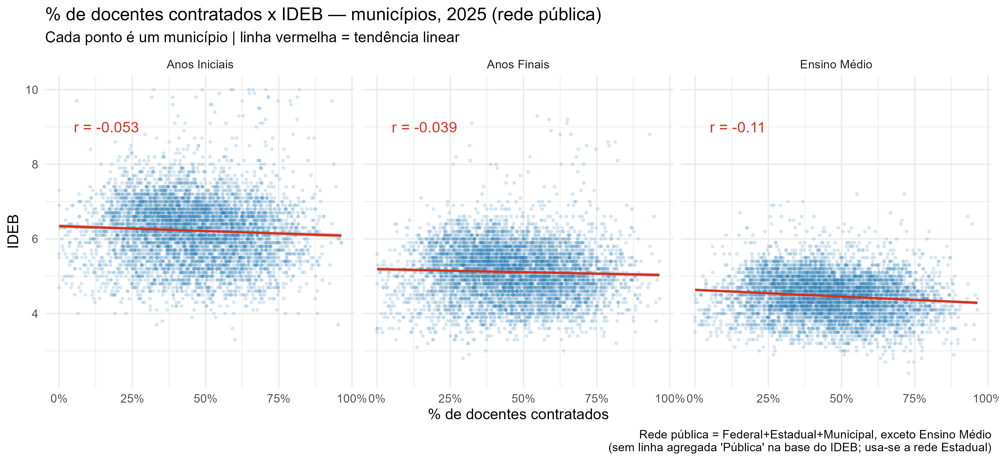

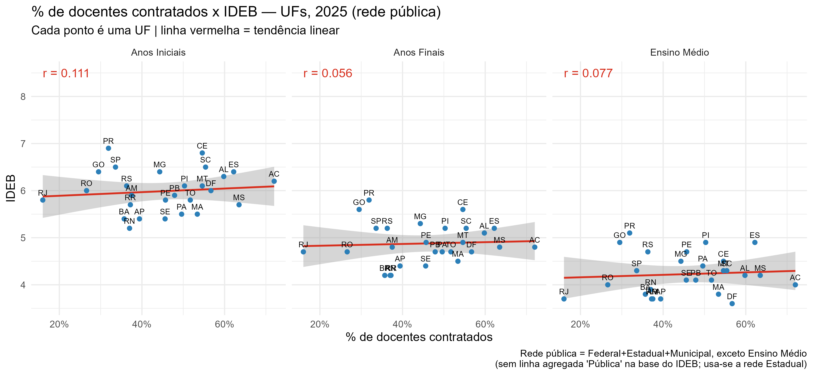

Os gráficos de dispersão (município e UF, um painel por etapa) tornam visível o que os números de correlação já indicam: as nuvens de pontos são dispersas e sem padrão visual claro, com uma linha de tendência praticamente plana (levemente descendente). Não há, visualmente, nenhum agrupamento que sugira um efeito de limiar (por exemplo, "acima de X% de contratados o IDEB despenca") nem uma relação linear forte em nenhuma direção. No gráfico por UF, é possível ver, por exemplo, que Roraima (RR) e Rio de Janeiro (RJ) têm IDEB relativamente baixo com percentuais de contratados muito diferentes entre si (RR tem um dos maiores percentuais de concursados do país, RJ tem o maior percentual de concursados de todos), o que já ilustra, por si só, que o vínculo contratual não é um previsor consistente do IDEB quando se olha caso a caso.

---

## 4. Discussão e síntese das conclusões

1. **Quase 2 em cada 5 docentes da rede pública (40,8%) têm vínculo contratado, não concursado.** Esse é o número-chave do retrato de 2025: entre os docentes com vínculo informado (essencialmente a rede pública), a maioria ainda é concursada (56,7%), mas a fração de contratados temporários é grande demais para ser tratada como marginal.

2. **A rede privada (21,8% dos docentes) simplesmente não reporta essa informação ao Censo**, o que limita todo o indicador de vínculo à rede pública e deve ser lembrado sempre que se falar em "percentual de docentes contratados no Brasil".

3. **A estabilidade do vínculo varia muito entre as três redes públicas**: a rede federal é a mais estável (13,5% de contratados), a rede estadual é a mais dividida e a mais dependente de contratação temporária proporcionalmente (49,6%), e a rede municipal, apesar de majoritariamente concursada, ainda tem mais de um terço de seus docentes (36,9%) sob contrato temporário — sobre a maior base absoluta de docentes do país, o que a torna também a rede com o maior número absoluto de docentes contratados.

4. **A zona rural depende muito mais de contratação temporária que a zona urbana** (56,4% contra 37,6%), sugerindo que a fragilidade do vínculo contratual está concentrada nas áreas mais distantes e de menor atratividade para fixação de efetivos, mesmo concentrando uma fração pequena do total de docentes do país.

5. **Regionalmente, Centro-Oeste, Nordeste e Norte concentram, proporcionalmente, mais contratação temporária**; Sudeste e Sul concentram mais concursados (e também praticamente toda a categoria CLT). Ao nível de UF, a variação é enorme, indo de 10,5% (Rio de Janeiro) a 67,7% (Acre) — mais de seis vezes de diferença entre os extremos.

6. **Percentual alto e número absoluto alto de docentes afetados são coisas diferentes.** O Acre tem a maior taxa de contratação (67,7%) mas apenas 8.726 docentes contratados; São Paulo tem uma taxa moderada (23,5%) mas 141.239 docentes contratados, o maior contingente absoluto do país — ambas as leituras são válidas, mas respondem perguntas diferentes.

7. **A heterogeneidade municipal é ainda maior que a estadual.** Municípios variam de 0% a mais de 96% de docentes contratados, muitas vezes dentro da mesma UF (o boxplot por UF mostra caixas muito largas em estados como Roraima e Rio de Janeiro), o que indica que diagnósticos e políticas formulados apenas no nível estadual podem mascarar realidades municipais completamente distintas.

8. **A educação infantil ganhou peso relativo na década (2015–2025)** em todas as redes e localizações, subindo de 19,6% para 24,7% da força docente nacional, com o crescimento mais expressivo concentrado na rede municipal (+43%) e nas áreas urbanas, provavelmente refletindo a expansão de creches e pré-escolas no período (e uma recuperação acelerada pós-pandemia entre 2020 e 2022); os anos finais do fundamental perderam peso relativo (de 34,2% para 31,0%), e os anos iniciais estaduais recuaram quase 22%, coerente com o processo histórico de municipalização dessa etapa.

9. **Não há evidência de que o tipo de vínculo contratual, isoladamente, explique diferenças relevantes de desempenho educacional (IDEB).** As correlações entre % de docentes contratados e IDEB são estatisticamente significativas ao nível de município (por conta do tamanho grande da amostra), mas de magnitude muito baixa (r entre -0,04 e -0,11); ao nível de UF, com apenas 27 observações, nenhuma correlação é estatisticamente significativa. O sinal, quando detectável, é sempre negativo (mais contratação, IDEB levemente menor), mas pequeno demais para ser tratado como uma explicação central. Outros fatores (contexto socioeconômico, infraestrutura escolar, formação docente, entre outros) provavelmente pesam muito mais na explicação das diferenças de IDEB do que o tipo de vínculo contratual isoladamente.

Em conjunto, esses resultados sugerem que o problema da contratação temporária no magistério público brasileiro é real, expressivo e desigualmente distribuído (por rede, por localização, por região e, principalmente, por município), mas que seu impacto direto e isolado sobre o indicador de desempenho educacional mais usado no país (o IDEB) é, com os dados de 2025, estatisticamente fraco. Isso não significa que o vínculo contratual seja irrelevante para a qualidade da educação — apenas que essa relação, se existir de forma mais substantiva, provavelmente opera de forma indireta ou em conjunto com outros fatores, e não como uma relação simples e direta capturada por uma correlação bivariada.

---

## Fontes e material de apoio

Microdados do Censo Escolar da Educação Básica, INEP, edições 2015 a 2025. Divulgação oficial do IDEB, edição 2025, INEP. Todas as figuras referenciadas neste relatório estão em `outputs/figures/` e as tabelas de apoio completas (incluindo as bases usadas para construir cada figura) em `outputs/tables/`, geradas pelos scripts em `R/` (ver `README.md` do projeto para o pipeline completo, executável via `run_all.R`).
